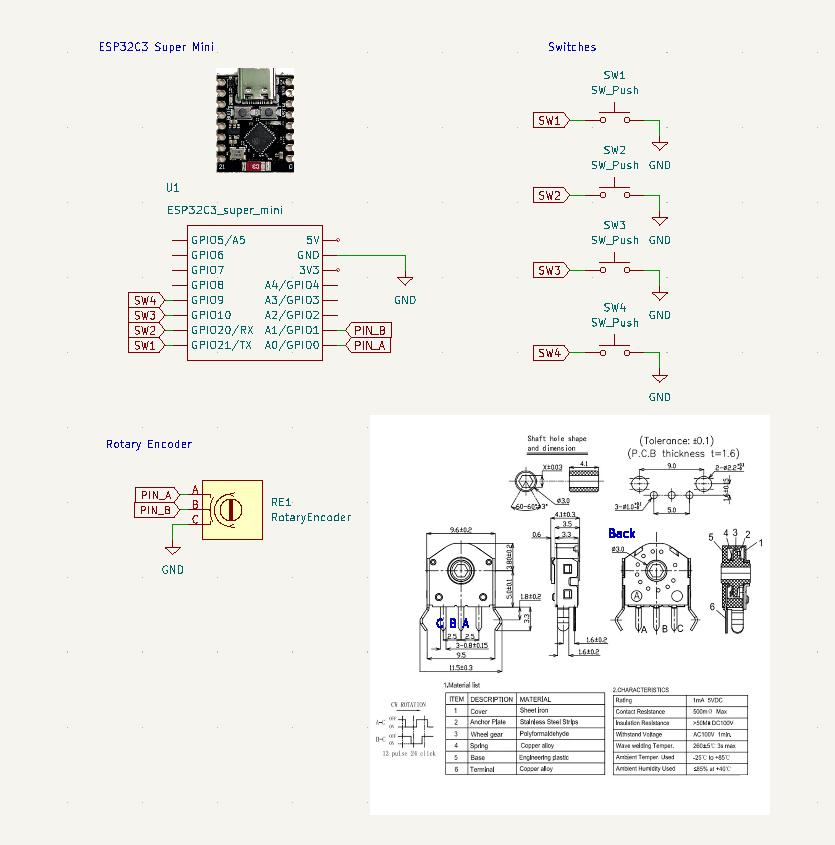

# mini-media-control-bar


A tiny media control bar based on ESPHome.

- **4 Keys + 1 Rotary Encoder Knob**
- **Acts as a BLE Keyboard with WiFi connectivity (ESP32-C3 Super Mini)**
- **Seamless Home Assistant integration via ESPHome**
- **Customizable 3D Printed Enclosure (designed in OpenSCAD)**

## BOM

| Component                      | Quantity | Notes                                                     |
| :----------------------------- | :------- | :-------------------------------------------------------- |
| ESP32-C3 Super Mini            | 1        |                                                           |
| Low-profile Cherry MX Switches | 4        |                                                           |
| Low-profile Keycaps            | 4        |                                                           |
| Generic Mouse Rotary Encoder   | 1        | 3-pin, H5.5mm x W9.5mm                                    |
| Φ1.75mm PLA filament           | -        | Used as the shaft for the knob.  A short piece is needed. |
| Magnets (Optional)             | 2        | Φ3mm x 6mm Neodymium (for mounting)                       |
| M2 x 6mm Self tapping screws   | 5        |                                                           |
| Wire                           | -        |                                                           |
| LOCTITE                        | -        |                                                           |





## 3D Printed Parts

- See the [`./enclosure`](./enclosure/) directory.


## Software

- The firmware is built using [ESPHome](https://esphome.io/). (`2025.3.3`)
- Reference the package definition [`mmcb.yaml`](./mmcb.yaml) via URL directly or download to your local.

```yaml
# In your esphome config file:
packages:
  mmcb:
    url: https://github.com/likeablob/mini-media-control-bar
    ref: main
    files:
      - path: mmcb.yaml
        vars:
          ble_device_name: "mmcb-1"

# or download to common/mmcb.yaml then reference it
packages:
  mmcb: !include
    file: common/mmcb.yaml
    vars:
      ble_device_name: "mmcb-1"
```

## Usage

| Key               | Default        | With Meta        | Special            |
| :---------------- | :------------- | :--------------- | :----------------- |
| Key 1 (Left-most) | Meta key       | N/A              | Double-click: Mute |
| Key 2             | Play/Pause     | Mute             |                    |
| Key 3             | Previous track | Left arrow       |                    |
| Key 4             | Next track     | Right arrow      |                    |
| Knob              | Volume Up/Down | Right/Left arrow |                    |

See [`mmcb.yaml`](./mmcb.yaml) for configuration options.

## License

MIT
