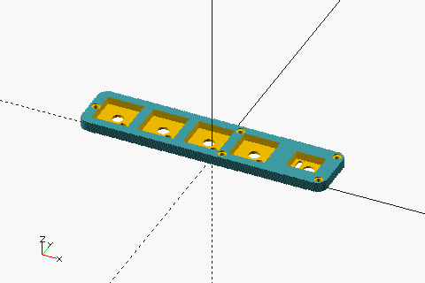
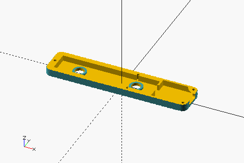
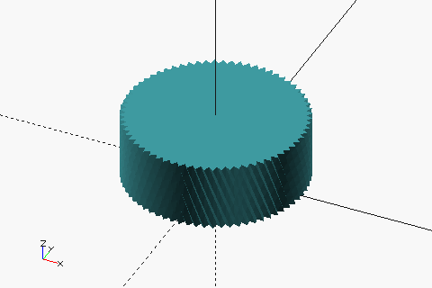

# mini-media-control-bar/case

## Prerequisites

- OpenSCAD (nightly build) 2025.02
- GNU Make
- ImageMagick
- BOSL2 (included as submodule)

## Build

```sh
$ git submodule update --init --recursive

# Generate .scad and .stl files.
$ make all -B

# Generate thumbnail images.
$ make images -B
```

## Parts

|                                     | STL                                  |
| ----------------------------------- | ------------------------------------ |
|     | [mmcb_top.stl](./mmcb_top.stl)       |
|  | [mmcb_bottom.stl](./mmcb_bottom.stl) |
|    | [mmcb_knob.stl](./mmcb_knob.stl)     |

## Print conditions

- 1.75mm PLA
- 0.2mm layer height
